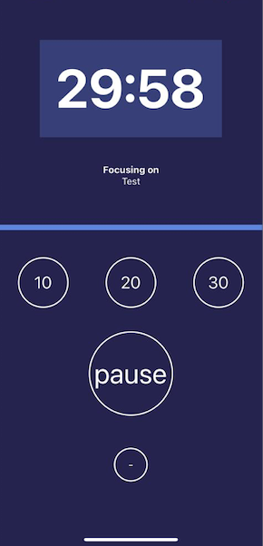

# FocusTime - Jose Abel Ramirez Frontany



## Built With

- Expo-app
- React
- React-Native

## Getting Started

To get a local copy up and running follow these simple example steps.

### Setup

Go to the top of the page, press te green button that says "Code", and copy the link. Then you have to go to your console and type

```
    git clone 'repository-link'
```

That's all, you are ready to go!

### Install

Run the following command to have all yarn packages dependencies installed:

```
    yarn
```

Run the following command to have expo-cli install globally:

```
    npm install -g expo-cli
```

### Usage

To run the app on iOS, run the following script:

```
    yarn ios
```

To run the app on Android, run the following script:

```
    yarn android
```

## Author: Jose Abel Ramirez Frontany\*\*

- GitHub: [Jose Abel Ramirez Frontany](https://github.com/jose-Abel)
- Linkedin: [Jose Abel Ramirez Frontany](www.linkedin.com/in/joseabelramirezfrontany)

## 🤝 Contributing

Contributions, issues, and feature requests are welcome!

## 📝 License

This project is MIT licensed.

## Show your support

Give a ⭐️ if you like this project!

